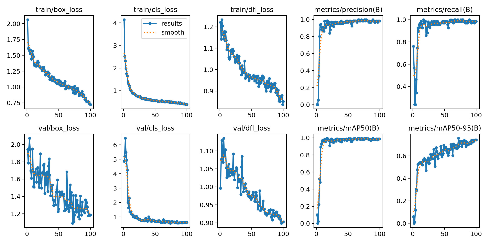
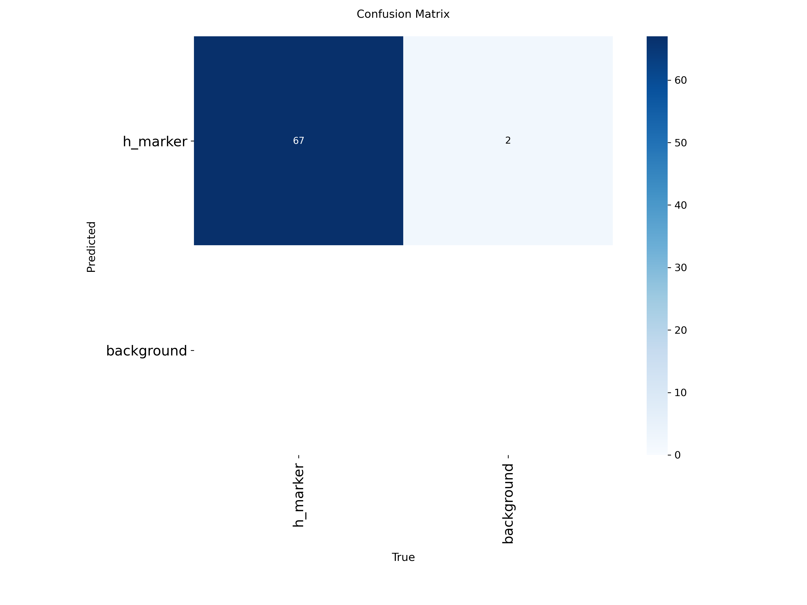
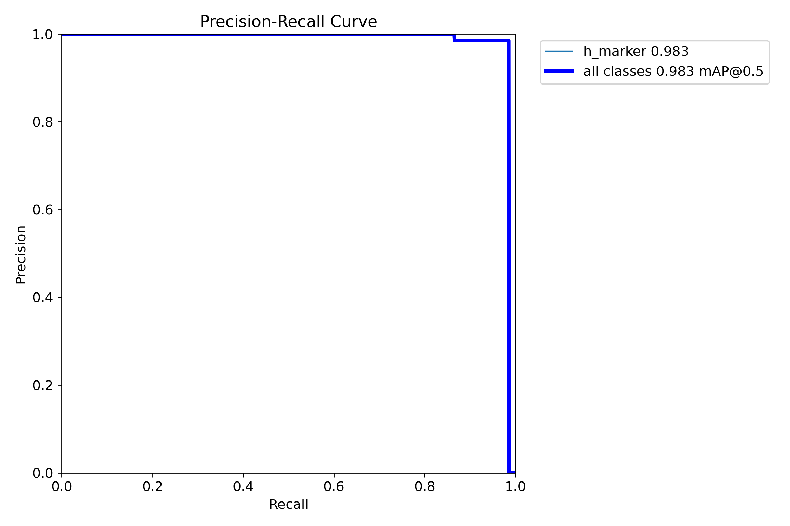
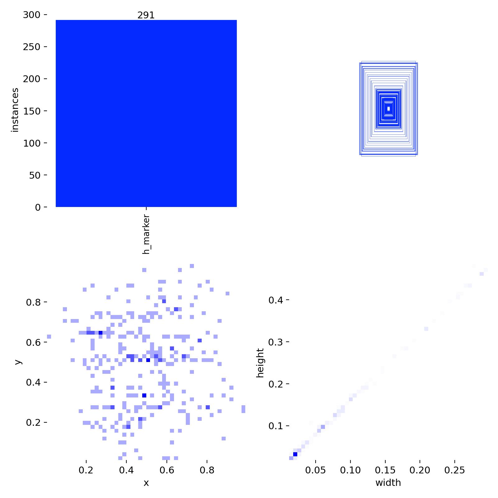
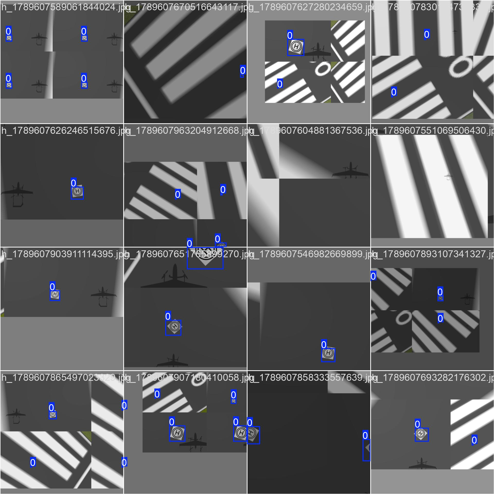
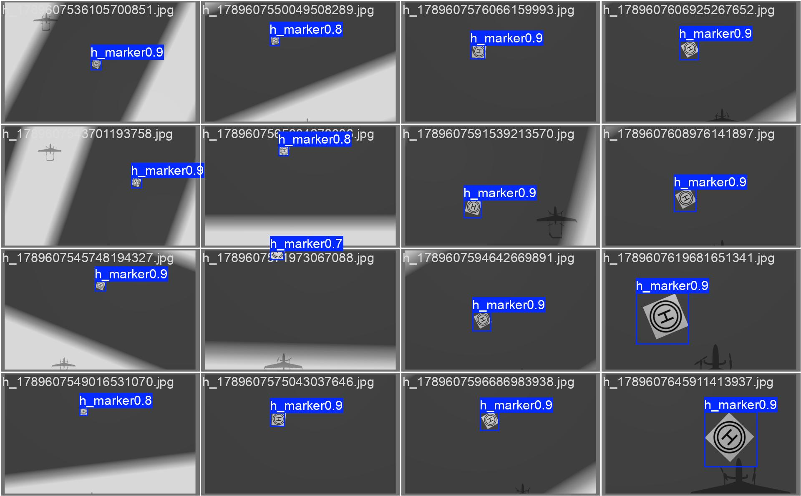

# YOLO 训练结果解读指南

`runs/detect/train/` 目录里保存了 Ultralytics 训练结束后自动生成的图表和文件。下面说明每个文件的作用，以及如何解读。

> 本指南以 `runs/detect/train/` 为例。如果你训练了多次，路径可能是 `runs/detect/train2/`、`runs/detect/train4/` 等，对应文件含义相同。

---

## 1. `results.png` — 训练过程总览

最常用的一张图，10 个子图分别画了整个训练过程的损失和指标：

| 子图 | 含义 | 怎么看 |
|---|---|---|
| `train/box_loss` | 训练集边界框回归损失 | 应该持续下降 |
| `train/cls_loss` | 训练集分类损失 | 应该持续下降 |
| `train/dfl_loss` | 训练集分布焦点损失（DFL） | 应该持续下降 |
| `val/box_loss` | 验证集边界框损失 | 下降后趋于平稳，若后期上升可能过拟合 |
| `val/cls_loss` | 验证集分类损失 | 同上 |
| `val/dfl_loss` | 验证集 DFL 损失 | 同上 |
| `metrics/precision(B)` | 验证集精确率 | 越接近 1 越好 |
| `metrics/recall(B)` | 验证集召回率 | 越接近 1 越好 |
| `metrics/mAP50(B)` | IoU=0.5 时的平均精度 | 主要指标，通常 >0.9 算很好 |
| `metrics/mAP50-95(B)` | IoU 从 0.5 到 0.95 的平均精度 | 对框位置精度更敏感 |



**典型解读**：到训练后期，precision、recall、mAP50 都接近 0.98~0.99，mAP50-95 约 0.74，说明模型已经收敛得不错，但框的定位精度（mAP50-95）还有提升空间。

---

## 2. `results.csv` — 原始数值

`results.png` 的数据来源，每行对应一个 epoch 的指标。

最后一行（epoch 100）的关键数值示例：

```text
precision: 0.983
recall:    0.985
mAP50:     0.988
mAP50-95:  0.743
```

想看任意一列的变化，可以直接用 Python/Excel 打开这个 CSV 画图。

---

## 3. `confusion_matrix.png` / `confusion_matrix_normalized.png` — 混淆矩阵

显示模型把真实目标分成了哪几类。

- 行是 **Predicted（模型预测）**
- 列是 **True（真实标签）**



**典型解读**：

- `h_marker` 真实目标中，大部分被正确预测为 `h_marker`
- 少量被错分成 `background`（漏检）
- 如果 `background` 行有数字，表示把背景误检成目标（假阳性）

整体漏检率很低，说明模型检测能力较强。

---

## 4. `BoxPR_curve.png` — Precision-Recall 曲线

横轴 Recall（召回率），纵轴 Precision（精确率）。曲线越靠近右上角越好，图例中的数字就是 **mAP@0.5**。



**典型解读**：`h_marker 0.983`，`all classes 0.983 mAP@0.5`，说明在 IoU=0.5 阈值下检测精度几乎完美。

---

## 5. `BoxP_curve.png` / `BoxR_curve.png` / `BoxF1_curve.png`

分别表示在不同置信度阈值下：

- `BoxP_curve.png`：Precision 的变化
- `BoxR_curve.png`：Recall 的变化
- `BoxF1_curve.png`：F1 分数（Precision 和 Recall 的调和平均）的变化

通常用来选一个合适的置信度阈值。比如 F1 最高点对应的置信度，可以作为部署时的 `conf` 参数。

---

## 6. `labels.jpg` — 数据集标签分布

这张图反映训练数据的标注分布，常见三块：

- 上方柱状图：每个类别的样本数量
- 左下散点图：边界框中心点在图像中的分布（x, y 归一化到 0~1）
- 右下散点图：边界框宽度与高度的关系



**典型解读**：

- 如果中心点过度集中在画面中央，说明缺少边缘样本，可能需要更多边缘视角的数据
- 如果宽高分布很窄，说明目标大小变化不多，远距离/小目标样本可能不足

---

## 7. `train_batch*.jpg` — 训练批次可视化

Ultralytics 在训练开始和后期会随机抽一个 batch，展示经过 Mosaic 增强、Resize 等预处理后的训练样本和它们的真值框。



- 蓝色框是 ground truth
- 数字是类别编号（例如 `0` 对应 `h_marker`）
- 能看到多张小图拼接、旋转、缩放等 augmentation 效果

**主要用来检查**：

- 标签是否正确
- 增强是否合理
- 有没有把目标切掉或变形太厉害

---

## 8. `val_batch*_labels.jpg` / `val_batch*_pred.jpg` — 验证集对比

| 文件 | 内容 |
|---|---|
| `val_batch*_labels.jpg` | 验证集图片 + **真实标注框** |
| `val_batch*_pred.jpg` | 验证集图片 + **模型预测框** + 置信度 |



**用法**：把同一张图片的 `labels` 和 `pred` 对比，就能直观看出：

- 有没有漏检
- 框是否偏了
- 置信度是否稳定

---

## 9. 权重文件

| 文件 | 说明 |
|---|---|
| `weights/best.pt` | 验证集 mAP50 最高的模型，部署时用这个 |
| `weights/last.pt` | 最后一 epoch 的模型，可作为继续训练的起点 |

部署时一般把 `best.pt` 复制到 `scripts/`：

```bash
cp runs/detect/train/weights/best.pt scripts/
```

---

## 10. 结论与优化方向

如果一次训练结果类似下面这样：

- `mAP50 ≈ 0.98`
- `mAP50-95 ≈ 0.74`

说明检测能力已经饱和，但框的位置精度还能提升。可以尝试：

1. 增加更多远距离、小目标、边缘视角的样本
2. 让 `target_auto_poser.py` 覆盖更多距离和角度
3. 训练更多 epoch 或换更大的模型（如 `yolov8s.pt`）

如果主要用来做 yaw/pitch 角度估计，`mAP50` 高、漏检少就已经够用了。
